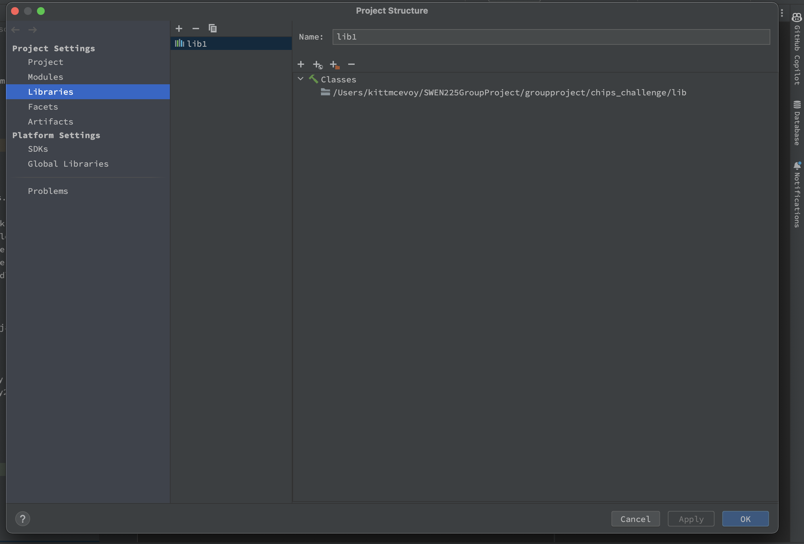
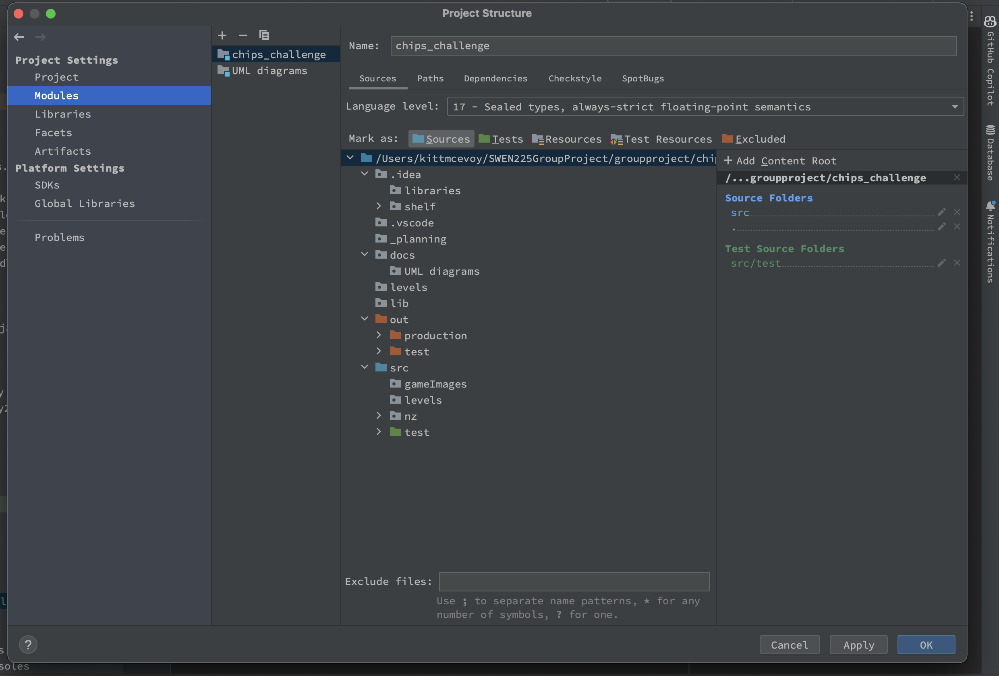

Start the game by running nz.ac.vuw.ecs.swen225.gp22.app.Main from your chosen IDE.

To play the Game select from level 1 choose "Start Game", to Load a game choose "Load game" and to play a recorded game choose "Load recording".

The keys for this game are the up, down, left and right arrow keys.

If the game does not compile, please make sure the Project structure for the Modules looks like this:

And the Libraries looks like this:

NOTE: We are having a strange bug with the IDE in InputStrategy.java where we sometimes get errors when InputStrategy is public,
but then without changing code it sometimes works. The fix is to remove 'public' from the InputStrategy, which works until it starts giving errors again, with the fix
being to make InputStrategy public again.
